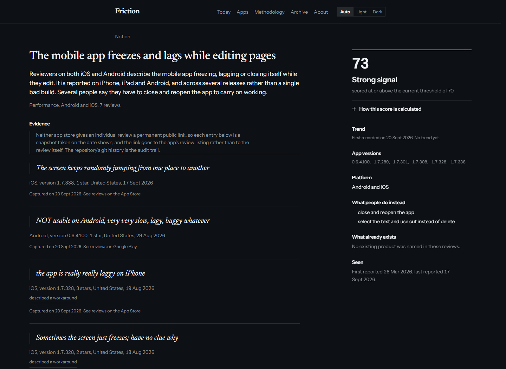
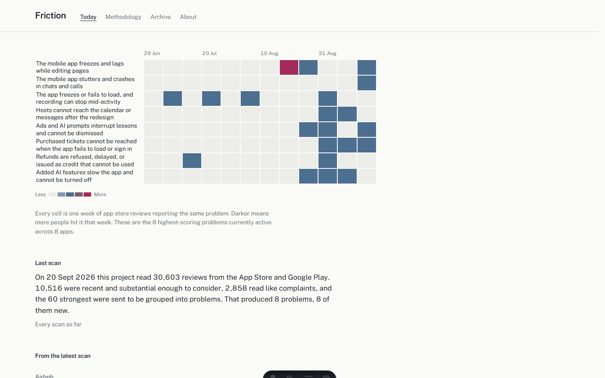

# Friction

A free, automatically-updating index of recurring complaints about widely used mobile apps, built from public App Store and Google Play reviews, with every score computed in code and shown in full.

**Live site:** https://jayharwani.github.io/friction/



## Why it exists

Tools in this category hide their evidence and their scoring behind a paywall, and the largest of them shut down over data licensing. That leaves product people guessing about what is actually broken in a product, or paying for a number they cannot audit. Friction publishes the number, the seven components behind it, the raw counts behind each component, and every review quote it was derived from. It is free, non-commercial, and the whole method is in this repository.

## How it works

The homepage hero is the data itself: rows are the highest-scoring active problems, columns are the last twelve ISO weeks, and each cell is shaded by how much evidence arrived that week.



1. **Fetch.** Every run reads up to ten pages of Apple's public customer reviews feed for each tracked app across four storefronts, plus recent Google Play reviews, at one request per second. Roughly 30,000 reviews come in.
2. **Screen and filter.** Deterministic rules, in code, drop anything already processed, older than 180 days, too short, or matching a crisis-language screen. What survives is kept only if it is rated three stars or lower and contains a complaint marker. The survivors are ranked and capped at sixty.
3. **Group.** Those sixty go to Claude with one job: group reviews describing the same underlying problem and copy a short verbatim quote from each. It is explicitly forbidden from producing any number.
4. **Validate.** The output is parsed against a strict schema, and every quote is checked character by character against the review it claims to come from. Any failure exits non-zero and nothing is written, leaving the previous data intact.
5. **Score and publish.** Seven weighted components are computed in TypeScript, a verdict is assigned, the records are committed, and the static site is rebuilt.

## Design decisions worth defending

- **The score is computed in code and shown in full.** Open "How this score is calculated" on any problem page and you get all seven components, the raw count behind each one, the weight applied, and arithmetic that sums to the published number.
- **The model never produces a number.** It extracts and groups. Every score, rank and verdict comes from `src/lib/scoring.ts`, which has exactly one implementation and is imported by both the build scripts and the site.
- **Most problems are rejected.** The "Strong signal" threshold is the higher of 70 and the 80th percentile of active scores, which holds the pass rate near one in five. A site where everything looks promising is worth nothing.
- **No reviewer names are stored.** Names are hashed with a secret salt the moment they are read and discarded. The hash is never rendered.
- **Raw review text is deleted after 30 days.** Full bodies exist only in a run's intermediate files. Published records keep a quote capped at 25 words and nothing more.
- **Apps about personal distress or health are never tracked,** and the check runs before any network request. The seed list is not exempt from it.
- **Review permalinks are not faked.** Neither store gives an individual review a stable URL, so evidence links to the app's review listing and is labelled with the date it was captured.

## Setup

Two secrets and one settings change. There are no API keys to obtain — both data sources are public.

1. **Add repository secrets** under Settings → Secrets and variables → Actions:
   - `AUTHOR_SALT` — any long random string. Generate it once and do not change it:
     ```bash
     node -e "console.log(require('crypto').randomBytes(32).toString('hex'))"
     ```
     Rotating it does not corrupt existing data — each review is hashed once, ever — but a reviewer who posts again after a rotation will be counted as two people.
   - `CLAUDE_CODE_OAUTH_TOKEN` — from running `claude setup-token` locally. Claude Pro and Max subscribers can generate this, and it routes the work through the subscription rather than API billing.
2. **Settings → Pages → Source: GitHub Actions.**
3. **Run the `scan` workflow manually once** from the Actions tab, and read its output.
4. **Confirm the site is live,** then uncomment the `schedule` block at the top of `.github/workflows/scan.yml` to let it run every Monday.

Scheduled workflows in a public repository are disabled automatically after 60 days with no repository activity. The weekly scan commits data, which counts as activity, so this should not arise — but it is worth knowing. GitHub may also delay scheduled runs during periods of high load.

### Running it locally

```bash
npm install
cp .env.example .env     # then fill in AUTHOR_SALT
npm run resolve-apps     # fills in Apple ids, verifies Play packages
npm run fetch            # add --only=notion,slack --pages=2 for a fast run
npm run validate
npm run score
npm run dev
```

## Stack

| Layer | Choice |
|---|---|
| Runtime | Node 22 |
| Language | TypeScript, strict |
| Site | Astro, static output |
| Styling | Tailwind 4 via `@tailwindcss/vite` |
| Validation | Zod |
| Play reviews | `google-play-scraper` |
| Data store | JSON files in this repository |
| Scheduler | GitHub Actions |
| Hosting | GitHub Pages |

No React, no client-side router, no state library, no database. The only client-side JavaScript is what a native `<details>` element does on its own.

The spec this was built from pins Astro 5; Astro 7 is current and its Tailwind setup is what the current docs prescribe, so that is what is used. The deviation is noted in `astro.config.mjs`.

## Repository map

```
data/
  products.json        tracked apps, Apple ids resolved by script
  seen.json            review ids already processed
  runs.json            every scan, with funnel counts
  candidates/          filtered reviews fed to the model, pruned after 30 days
  extracted/           validated model output, pruned after 30 days
  problems/            canonical problem records, one file each, never pruned
scripts/
  resolve-apps.ts      fills appleId, verifies Play packages, runs the denylist
  fetch.ts             both stores, screening, filtering, funnel accounting
  extract-prompt.md    the prompt Claude executes
  validate.ts          Zod schemas, screening rules, and the CLI gate
  score.ts             merge, score, verdict, write
  prune.ts             enforces the 30-day deletion of raw review text
src/
  lib/scoring.ts       the only implementation of the formula
  lib/data.ts          typed loaders for data/
  lib/url.ts           base-path-aware internal links
  components/          recurrence grid, score disclosure, evidence item
  pages/               index, problems/[slug], products/[slug], methodology, archive, about, rss
.github/workflows/
  scan.yml             fetch, extract, validate, score, commit, then call deploy
  deploy.yml           build and publish to Pages
```

`npm test` covers the scoring formula with exact expected scores, the app denylist, the crisis screen, and the screening and ranking rules.

## Limitations

Read these before treating anything here as a conclusion.

- **English-language reviews only,** from four Apple storefronts and one Google Play storefront.
- **Mobile apps only,** and only the fifteen currently tracked. Desktop and web complaints are invisible to this method.
- **No permanent link to any individual review.** Neither store provides one. Evidence links to the app's review listing and carries the date it was captured; the git history of this repository is the audit trail. You cannot click through and re-read the original review.
- **Play data is read from public review pages,** not an API, so it is occasionally incomplete and can break without warning. The pipeline treats Play as optional and continues on Apple data alone when it fails.
- **Small samples on quieter apps.** A problem backed by four reviewers is a weak signal, which is why anything under four distinct reviewers is labelled "Thin evidence" regardless of its score.
- **Reviews are a self-selected sample.** People who write store reviews are disproportionately angry or delighted. This measures what gets complained about, which is not the same as what is most common.
- **A scored problem is a starting point for research, not a finding.** The score says this complaint recurs, across versions, from different people. It does not say the problem is worth your time.
